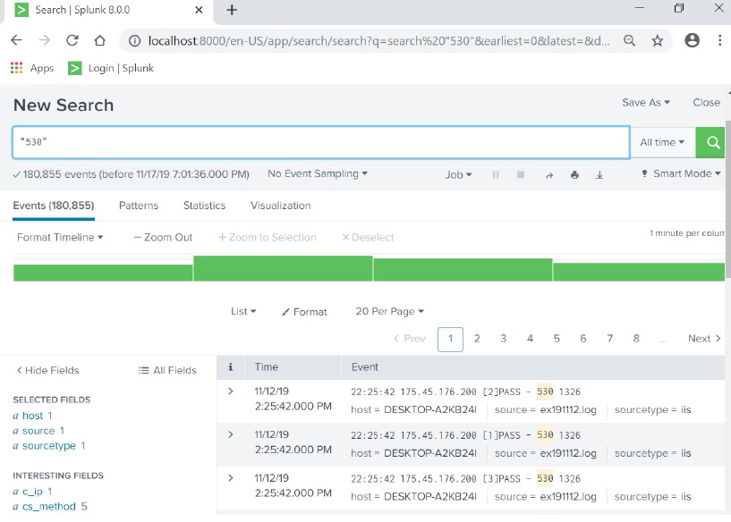
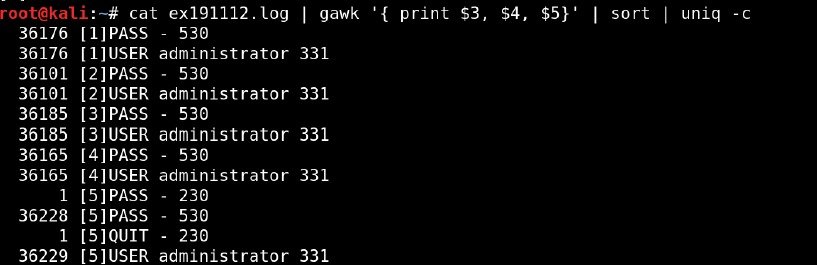
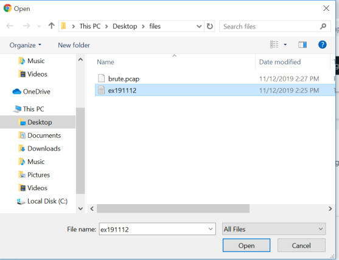
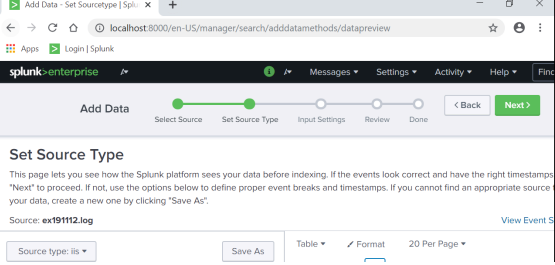

# Suspicious Authentication Investigation Using Splunk


## Threat Overview

This investigation focused on identifying suspicious authentication activity within IIS log data using Splunk and Linux command-line analysis techniques.

The objective was to validate failed authentication patterns and correlate suspicious login behavior across multiple analysis workflows.

---

## MITRE ATT&CK Mapping

| Technique | ID | Tactic |
|---|---|---|
| Brute Force | T1110 | Credential Access |
| Valid Accounts | T1078 | Defense Evasion |

---

## Investigation Timeline

1. Imported IIS authentication logs into Splunk
2. Validated source type parsing behavior
3. Searched failed authentication events
4. Correlated repeated login attempts
5. Parsed raw logs using Linux CLI tools
6. Validated suspicious authentication activity

---

## Technical Findings

### Key Findings

- Multiple failed authentication events were identified using IIS status code analysis
- Repeated login attempts indicated possible brute-force activity
- Linux CLI analysis validated authentication event frequency
- Splunk ingestion workflows successfully parsed IIS log data

---

## IOC Summary

| Indicator | Type |
|---|---|
| Status Code 530 | Failed Authentication |
| IIS Authentication Logs | Log Source |
| Repeated Login Attempts | Suspicious Activity |

---

## SPL Queries Used

```spl
index=main sourcetype=iis status=530
| stats count by src_ip, user
| where count > 10
```

---

## Detection Recommendations

- Monitor repeated IIS authentication failures
- Alert on abnormal login attempt spikes
- Correlate authentication failures across multiple systems
- Investigate unusual authentication behavior patterns

---

## Investigation Evidence

### Splunk Failed Login Analysis



---

### Linux Log Parsing Analysis



---

### Splunk Log File Selection



---

### Splunk Source Type Analysis



---

## Environment

| Component | Details |
|---|---|
| SIEM | Splunk |
| Operating System | Windows / Kali Linux |
| Analysis Tools | Splunk, Linux CLI |
| Log Source | IIS Logs |
